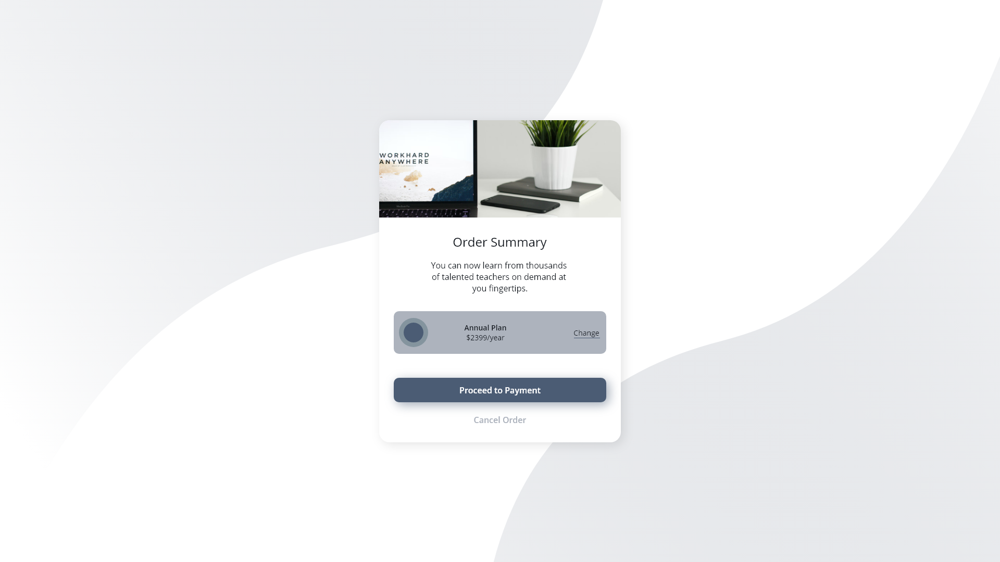

# Techover - Beställnings Kort.

Bakgrund
I det här projektet var min uppgift att bygga en beställningskort-komponent och säkerställa att den designmässigt överensstämde med prototyperna för både mobil- och desktop-format.

Vad jag gjorde
Jag valde att använda HTML och CSS för att skapa komponenten.
Jag byggde layouten och strukturen med semantisk HTML och använde CSS för att styla komponenten och göra den responsiv.
Responsiviteten implementerades med hjälp av media queries, så att designen anpassar sig sömlöst mellan mobil- och desktopformat.

Resultatet
Designen följdes noggrant för att återspegla en pixelperfekt implementation av beställningskortet. Funktioner och layout anpassades efter specifikationerna, vilket resulterade i en komponent som fungerar sömlöst på både mobil och desktop.

